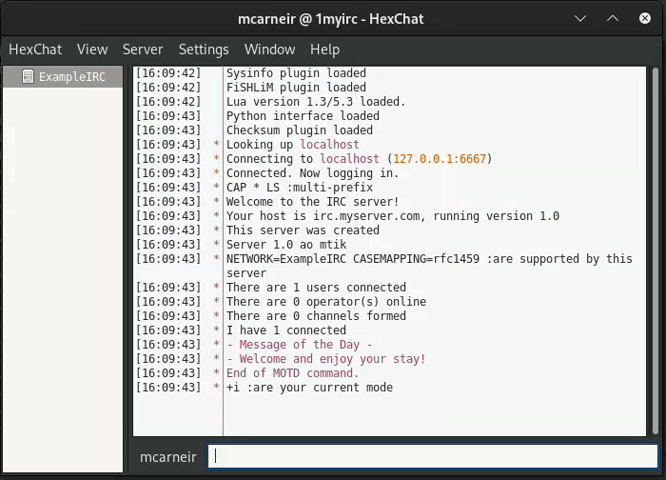

# ft_irc
>A IRC server in C++98

</p>
<p align="center">
	<a href="#about">About</a> •
	<a href="#usage">Usage</a> •
   <a href="#implementation">Implementation</a>
</p>


## About
The ft_irc project consists of implementing a simple **Internet Relay Chat (IRC)** server in C++. The server should be able to accept connections from multiple concurrent clients, handle disconnections, support private messaging and the creation of channels. A client can connect to the server using either **Hexchat** or the `nc` command.

## Usage
`git clone` this project and`cd` into its folder. Open a terminal and after you run `make` the program is ready to be executed as so:

```shell
./ircserv <port number> <password>
```

The server should now be ready and listening for connections. There are two ways to connect to the server: the `nc` command and the **Hexchat** IRC client application.

If connecting with `nc` the parameters are:

```shell
nc localhost <port number>
```

Once connected to the server, users have access to these commands:

1. PASS:
   - Before any other commands can be sent the user must first be authenticated by using the PASS command and typing the password defined on server creation.

2. NICK:
   - The `set_side_dist()` function calculates the side distances to determine the next intersection with a grid boundary in the map.

3. USER:
   - The `perform_dda()` function implements the DDA algorithm to trace the path of the ray through the map, checking for intersections with walls.

4. JOIN:
   - The `get_line_height()` function calculates the height of the wall that the ray hits, which determines how much of the wall will be displayed on the screen.

5. PRIVMSG:
   - The `raycaster()` function iterates through each column of the screen, casting rays and rendering the corresponding wall segments using the calculated line heights.
     
6. PART:
   - The `raycaster()` function iterates through each column of the screen, casting rays and rendering the corresponding wall segments using the calculated line heights.



## Implementation
Once connected to the server, users have access to these commands:
1. Ray Initialization:
   - The `init_ray()` function initializes a ray with the appropriate starting position and direction based on the player's position and camera settings.

2. Side Distances Calculation:
   - The `set_side_dist()` function calculates the side distances to determine the next intersection with a grid boundary in the map.

3. Digital Differential Analyzer (DDA):
   - The `perform_dda()` function implements the DDA algorithm to trace the path of the ray through the map, checking for intersections with walls.

4. Line Height Calculation:
   - The `get_line_height()` function calculates the height of the wall that the ray hits, which determines how much of the wall will be displayed on the screen.

5. Rendering:
   - The `raycaster()` function iterates through each column of the screen, casting rays and rendering the corresponding wall segments using the calculated line heights.

This process is repeated for each frame to continuously update the displayed scene as the player moves through the map. 


